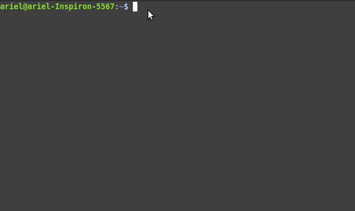
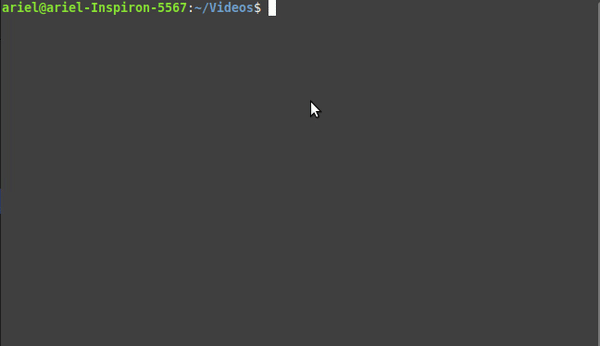

# Tmux Pro

## :bookmark: Requirements

- [Tmux](https://github.com/tmux/tmux) > 3.0

## :clapper: Demo


## :question: Why Tmux Pro?

- ### No hassle to use

  Tmux Pro does not use any dependencies other than [Tmux Plugin Manager]() use plugins and offers modifications. This makes it easier to use and decreases incompatibilities that may arise.

- #### Comes standard with plugins that increase your productivity

  Tmux comes with the following plugins:

- #### Easy to modify
   
   Didn't like a plugin or a color used by default? No problem, Tmux Pro was written so that any modification can be done quickly and easily. To see more how to modify your Tmux Pro, go here [customization](#customization)


## :building_construction: Install

``` bash
#Clone repository
git clone https://github.com/arielroque/tmux-pro.git

cd tmux-pro

#Allow execute instalation script
chmod +x ./install.sh

#Install 
sudo ./install.sh
```

## :pager: Usage

### :computer_mouse: Mouse Actions

Click your ```right mouse button``` to show quick actions on your tmux. Some of these actions are:

- Create Vertical Split
- Create Horizontal Slit
- Zoom Panel
- Kill Panel




### :page_facing_up: Tree Directory

To open the directory tree on your tmux just use ```prefix + Tab```



## :paintbrush: Customization

We know that customizing Tmux your way is important, so let's show you how easy it is with Tmux Pro


#### Open Tmux Configuration

It is from this configuration file that we will customize Tmux Pro. We'll use [Vim](https://github.com/vim/vim) as a text editor, but you can use another one like [Nano](https://github.com/madnight/nano) or even [Visual Code](https://github.com/microsoft/vscode)

```bash
#Open tmux config in yout System
vim ~/.tmux.config
```

#### Color Theme

In the configuration file, you will have a section called [color theme]() like this one here

```bash
######################
###  COLOR THEME   ###
######################

background_color='#282a36'
foreground_color='#f8f8f2'
current_line_color='#44475a'
primary_color='#1f4287'
...
...
```

We use color variables to change the text color and customize the background. To choose a new color, you can use this [website](https://htmlcolorcodes.com/) to get the hexadecimal color that represents it.


#### Status Bar


- ##### Status Left

to change the left status, go to the [status-left]() section

```bash
# status left
set -g status-left "#[bg=$foreground_color]#[fg=$background_color]#{?client_prefix,#[bg=$alert_color],} ☺ "
...
...
```


- ##### Status Right

to change the left status, go to the [status-right] section

```bash
# status right
set-option -g status-right "#[fg=$colour_secondary_text,bg=$weather_bg_color] #{weather} "
...
...
```

#### Plugins

In the configuration file, you will have a section called [plugins]() like this one here

```
######################
###    PLUGINS     ###
######################

# enable Tmux Pligin Manager plugins
set -g @plugin 'tmux-plugins/tpm'
set -g @plugin 'tmux-plugins/tmux-sensible'
...
...
```


## :confused: Uninstall

``` bash
#Allow execute uninstall script
chmod +x ./uninstall.sh

#Uninstall 
sudo ./uninstall.sh
```


## :rocket: Contributing

Pull request are also welcome , please read  [contributing](/CONTRIBUTING.md)  for details on our code of conduct, and the process for submitting pull requests to us.
    
-   Check  [issue templates](https://github.com/arielroque/tmux-pro/issues)  for the suggested issue formats

## :space_invader: Troubleshooting


